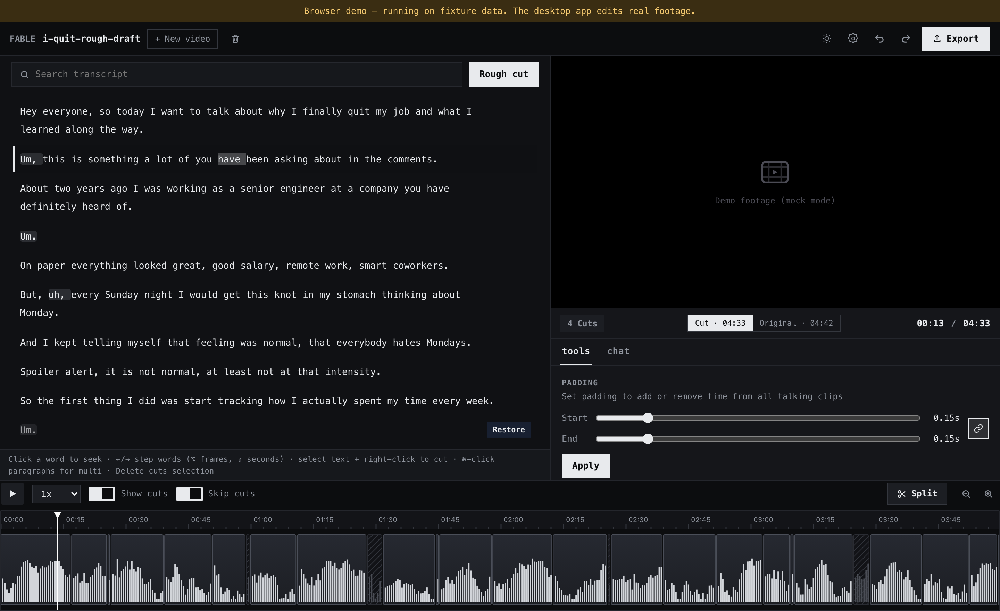

# RoughCut

**An open-source, local-first, AI-powered video editor.** Raw talking-head
footage goes in; a clean rough cut comes out — **entirely on your machine**.
Transcribe on-device, let a local LLM remove silences, filler words, and bad
takes, refine by editing the transcript or chatting with your footage, then
export to Premiere, Final Cut, or DaVinci Resolve. No upload, no
subscription, no account.

Uniquely, the editor exposes its tools over [MCP](https://modelcontextprotocol.io),
so Claude Desktop or Claude Code can drive it — the same tool registry powers
the local agent loop and the UI. One tool set, three callers.

> Mission: prove that a paid cloud AI service can be replaced by owned,
> local-first software. See [`docs/01-product.md`](docs/01-product.md).



---

## Highlights

- **Edit text, not timelines** — strike a sentence in the transcript and the cut follows; click a word to seek; ←/→ steps word-by-word with an audio cue
- **AI rough cut in one click** — on-device whisper transcription + silence/filler/take detection; composes with your manual edits and is one undo step
- **"Make this 20 minutes"** — semantic duration planner ranks segments by importance (local embeddings) and batches the cut, via chat or one tool call
- **Hybrid transcript search** — BM25 + local embeddings; "find the part about…" works on meaning, not keywords
- **NLE hand-off** — Premiere/Resolve XML, FCPXML, EDL, OTIO, SRT, or a rendered MP4
- **Claude can drive it** — 30+ MCP tools with batch editing; every external edit is tagged and undoable
- **Zero egress** — the only network use is user-triggered model downloads; everything is verifiable with a network monitor

---

## Using RoughCut

macOS 11+ (Apple Silicon or Intel).

### Install

**Option A — download:** grab the latest `.dmg` from
[Releases](https://github.com/PaulBratslavsky/roughcut-ai-local-first-editor/releases)
(unsigned for now: right-click → Open on first launch).

**Option B — build to use:**

```bash
git clone https://github.com/PaulBratslavsky/roughcut-ai-local-first-editor.git
cd roughcut-ai-local-first-editor/frontend && npm install && cd ../app/src-tauri
npx --yes @tauri-apps/cli@^2 build
# → target/release/bundle/dmg/ (workspace root)
```

Building needs [Rust](https://rustup.rs) 1.85+, Node 20+, and `cmake`
(whisper.cpp is compiled in-process).

### First-run setup

The app ships lean (~6 MB) and guides you through the rest from the **Setup
screen** (gear icon). Each capability lights up the moment it's available —
no restarts:

1. **Media engine** — `brew install ffmpeg` (detected automatically; powers
   import, waveforms, thumbnails, MP4 export)
2. **Speech-to-text** — one-click whisper model download in-app
   (checksum-verified; "Accurate" ≈ 547 MB recommended, "Compact" ≈ 190 MB
   for 8 GB machines)
3. **Chat editing + semantic search (optional)** — install
   [Ollama](https://ollama.com) and pull a chat model plus
   `nomic-embed-text`, or use the in-app managed
   [llama.cpp](https://github.com/ggml-org/llama.cpp) runtime. Without it,
   everything still works except conversational editing and semantic search.

Without ffmpeg or a speech model the app runs in honest **demo mode** on
fixture footage, so the whole edit loop is explorable with nothing installed.

### The edit loop

1. **Import** a video (drag & drop) — transcription starts on-device; the
   timeline shows progress while waveform and thumbnails generate
2. **Rough cut** — one click removes silences, fillers, and repeated takes
3. **Refine** — edit the script (select text → right-click → cut), drag clip
   boundaries on the timeline, split at the playhead, or tell the chat:
   *"cut the part about the salary"*, *"make this 20 minutes"*
4. **Preview** the cut with seamless audio at cut points; toggle Cut/Original
5. **Export** to your NLE — or render the MP4 directly (auto-reveals in Finder)

### Claude as your editor (MCP)

Run the app once (it writes the endpoint + per-install token to
`~/Library/Application Support/roughcut/mcp.json`), build the shim with
`cargo build --release -p roughcut-mcp-shim`, then:

**Claude Desktop** — add to `claude_desktop_config.json`:

```json
{
  "mcpServers": {
    "roughcut": { "command": "/path/to/target/release/roughcut-mcp-shim" }
  }
}
```

**Claude Code** — from any project:

```bash
claude mcp add roughcut -- /path/to/target/release/roughcut-mcp-shim
```

Claude can then read the transcript in pages, search it semantically, land a
batch of cuts in one `apply_edits` call, plan duration targets, and export.
Destructive operations (export, delete) ask **you** for confirmation in the
app. The full surface is documented in [`docs/tool-api.md`](docs/tool-api.md).

### DaVinci Resolve (free version included)

The Setup screen installs two Scripts-menu entries into Resolve
(Workspace ▸ Scripts ▸ Utility): **RoughCut AI Draft** turns a selected
media-pool clip into a transcribed, rough-cut timeline; **RoughCut Import
Cut** pulls your current RoughCut edit into Resolve, media auto-linked.
Both work on the free Resolve. On Resolve **Studio** (with external
scripting set to Local) the Export menu's **Send to DaVinci Resolve**
pushes the cut over without leaving RoughCut. Details:
[`resolve-plugin/`](resolve-plugin/).

---

## Contributing

The codebase is built to be navigable: state lives in one place, edits are
data, and the docs explain why things are the way they are.

### Dev loop

```bash
# prereqs: Rust 1.85+, Node 20+, cmake; ffmpeg recommended
cd frontend && npm install && cd ..

# frontend alone — runs in a plain browser on a full in-memory mock
cd frontend && npm run dev          # http://localhost:1420

# the desktop app (hot-reloads the frontend; Rust changes need a re-run)
cargo install tauri-cli --version '^2' --locked   # once
cargo tauri dev                                   # from app/src-tauri
```

### Tests

```bash
cargo test -p roughcut-core   # unit + e2e through the tool registry + MCP over HTTP
cd frontend && npx tsc --noEmit
```

The core suite includes a **mock-parity test**: every tool in the Rust
registry must exist in the browser mock (`frontend/src/ipc/mockApi.ts`), so
the two surfaces can't silently drift. Keep it green.

### Code map

```
core/        Rust core — models, tool registry, agent loop, MCP server, export
  engine/    the Editor: projects, media, edits+journal, semantic, confirmations
app/         Tauri v2 shell (src-tauri) wiring core ↔ frontend
frontend/    React + TanStack UI; playback/ is the engine, timeline/ the canvas
mcp-shim/    stdio ⇄ localhost proxy that Claude Desktop/Code spawn
resolve-plugin/  DaVinci Resolve Scripts-menu integration
docs/        planning docs, tool API contract, architecture walkthrough, ADRs
```

Start with [`docs/07-architecture.md`](docs/07-architecture.md) (how every
feature works and where it lives), then [`docs/tool-api.md`](docs/tool-api.md)
(the shared command surface). Decisions you shouldn't re-litigate are recorded
in [`docs/adr/`](docs/adr/).

### Invariants

- **Edits are data.** Every mutation is an `EditOp` through `Editor::apply_edit`;
  actions carry exact inverse/redo snapshots and the journal persists — undo
  survives restarts (ADR-0002)
- **One tool table.** Each tool is one `ToolSpec` row in `core/src/tools.rs`;
  schemas, the agent subset, MCP listing, and dispatch all derive from it
- **Generated frontend types.** Don't hand-edit `frontend/src/ipc/generated/`:
  ```bash
  TS_RS_EXPORT_DIR="/abs/path/to/frontend/src/ipc/generated" \
    cargo test -p roughcut-core --features ts-bindings export_bindings
  ```
- **One stylesheet.** `frontend/src/styles.css` is a single consolidated sheet
  (tokens → base → components → light theme). The design language is a clean,
  modern terminal: monospace, square corners, monochrome ink/paper. Never add
  an override layer; edit the component's one declaration.
- **Capabilities resolve at call time** — installing ffmpeg or downloading a
  model mid-session is picked up on the next operation

---

## Configuration

No secrets in the repo. Everything below is optional:

| Env var | Default | Purpose |
|---|---|---|
| `FABLE_DEMO` | auto | `1` forces fixture adapters (demo mode) |
| `INFERENCE_ENDPOINT` | `http://localhost:11434/v1` | OpenAI-compatible local server (Ollama / llama-server) |
| `INFERENCE_MODEL` | `gemma4:26b` | chat model tag for the agent loop |
| `EMBEDDING_MODEL` | `nomic-embed-text` | local embedding model for semantic search |
| `WHISPER_MODEL` | auto | override the whisper model path |
| `FFMPEG_PATH` / `FFPROBE_PATH` | auto (PATH, Homebrew, `<data dir>/bin`) | override the binaries |
| `ROUGHCUT_NO_CONFIRM` | unset | `1` skips confirmation prompts (scripted/CI runs) |

Optional frontier escalation (`connect_external` / `escalate_to_frontier`) is
**opt-in only**, uses your own API key stored in the OS keychain, and is never
auto-invoked.

---

## Principles (non-negotiable)

1. Local-first / zero egress by default — full function with networking disabled
   (verified: [`docs/zero-egress-verification.md`](docs/zero-egress-verification.md))
2. Non-destructive editing — source media is never modified; everything is undoable
3. The Rust core owns all state — the frontend is a view layer
4. One tool registry, three callers — local LLM, MCP clients, UI
5. Frame-exact time internally, seconds at the API edge
6. No accounts, no secrets in the repo

---

## Releases & packaging

Tagging `vX.Y.Z` builds an unsigned macOS `.dmg` plus the MCP shim via
[`release.yml`](.github/workflows/release.yml); signing/notarization activates
automatically once Apple Developer secrets are added (see the workflow
header). Deliberately **not** bundled, per the lean-app design: ffmpeg, model
weights (downloaded in-app, checksum-verified), and the llama-server sidecar.

---

## License

[GPL-3.0](LICENSE). Dependency licensing notes (FFmpeg build flavor, Gemma
weight terms) live in [`docs/04-tech-decisions.md`](docs/04-tech-decisions.md).
Model weights are downloaded by the user at runtime, never redistributed here.
